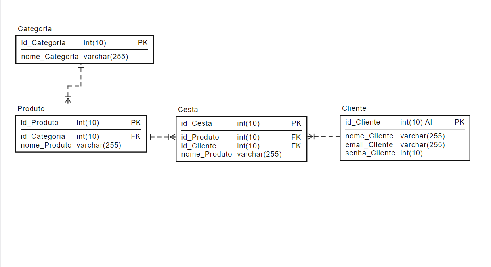
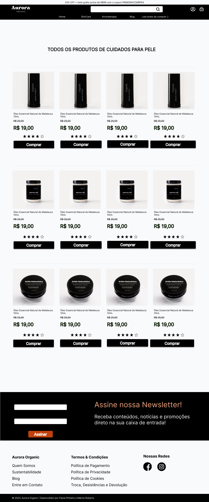
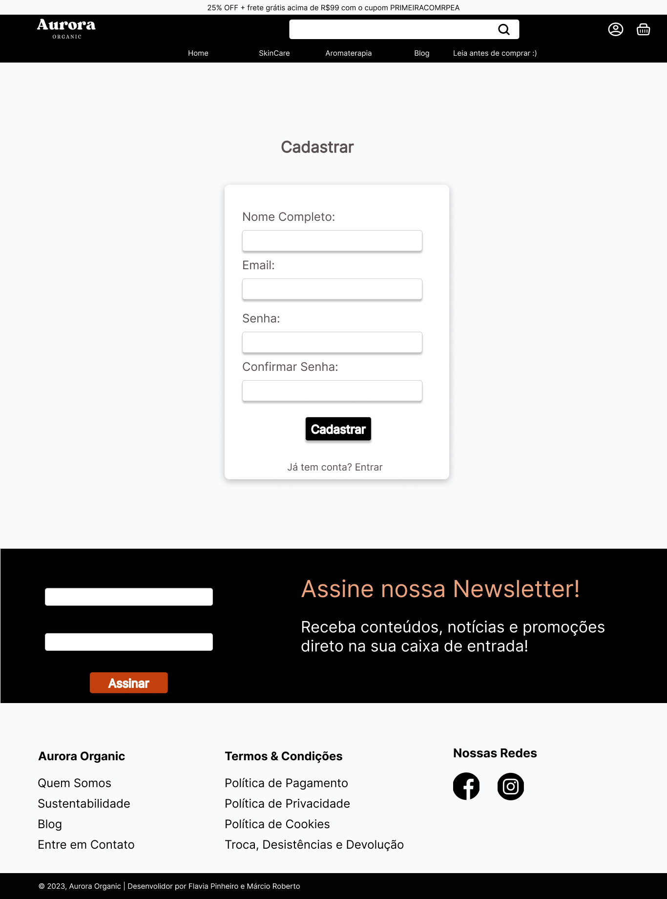
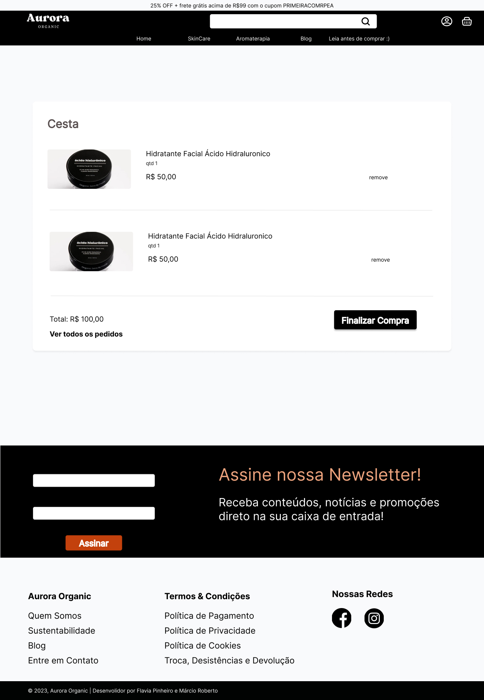
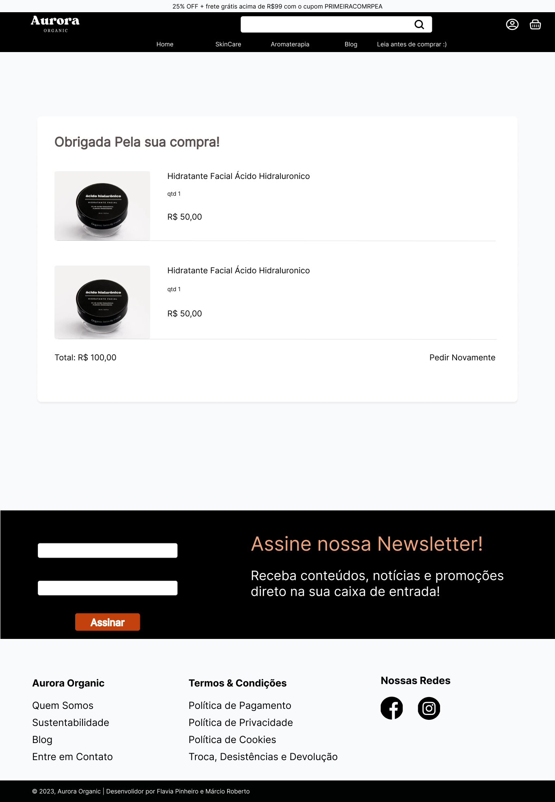
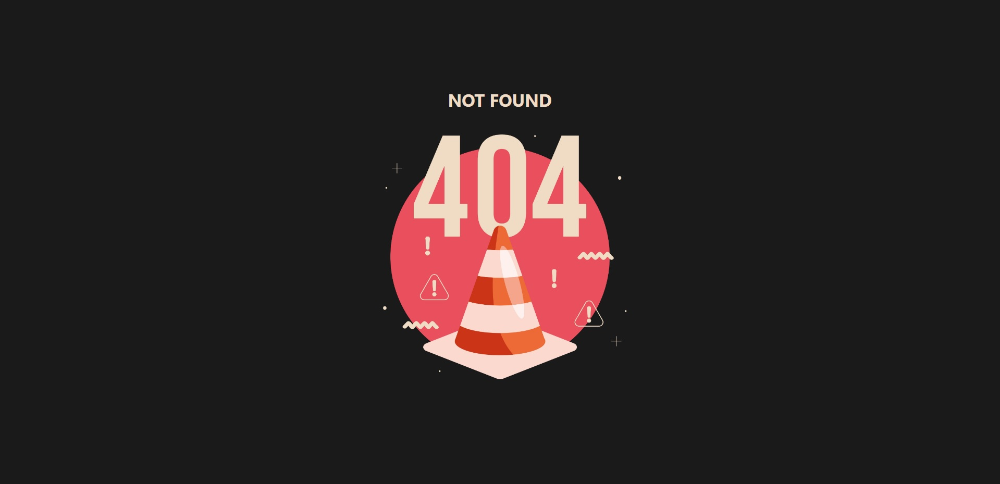

<h2>Projeto e-commerce Aurora Organic</h2>
<h3>
🚀 Tecnologias Utilizadas: <h3>

 React.js com vitejs; 

 Tailwind; 

 Node js; 

 MySQL . 

  
<h3>🚀 Modelagem do banco: <h3>
   
  
<h3>🚀 Protótipo: <h3>
  

  

    
Página Home 

    
  
 
  

    
Página Produto 

    
  
 
  

    
Página Produto 

    
  
 
  

    
Página Blog 

    
  
 
  

    
Página Sobre Nós 

    
  
 
  

    
Página Cadastro 

    
  
 
  

    
Página Login 

    
  
 
  

    
Página Cesta 

    
  
 
  

    
Página Pedidos 

    
  
 
  

    
Página de Erro 

    
  
 

